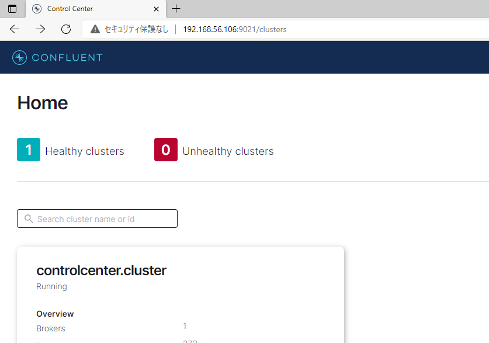
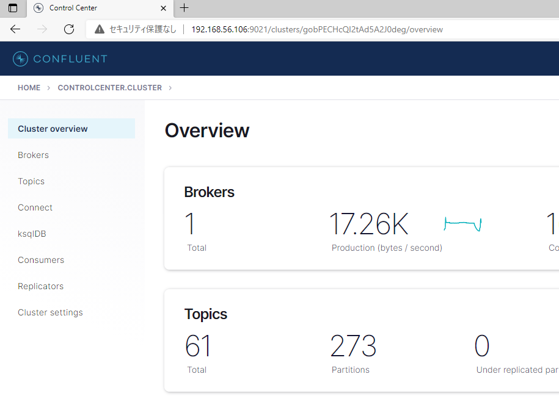
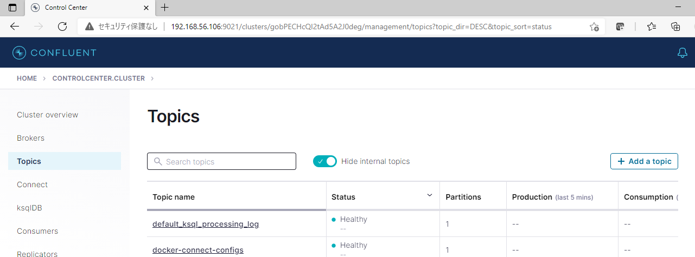
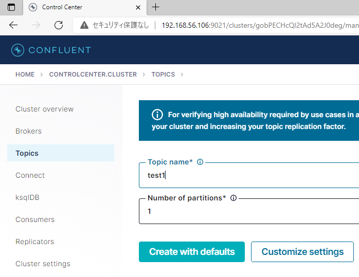
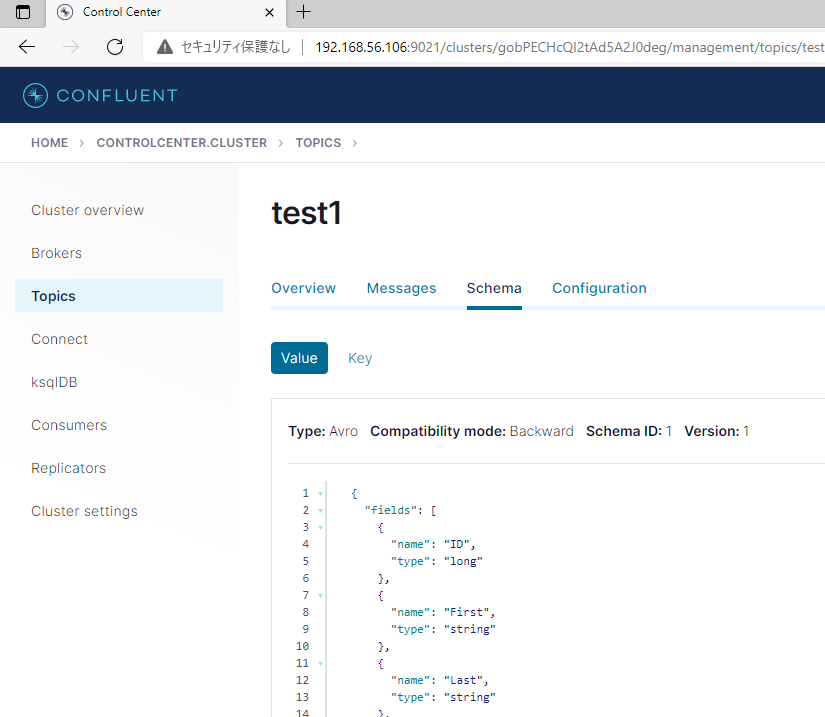
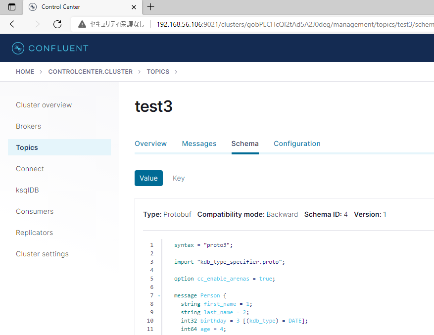

# Confluent Kafka Schema Registry

From kafkakdb 2.0, Confluent Kafka Schema Registry is supported[^1]. In the version 1, the only allowed message type was bytes or string. Using the schema registry, however, you can send whatever type of object so long as it is supported by conversion methods for the schema type. For example, Avro serializer can serialize a q dictionary and Protobuf serializer can handle the types supported by [protobufkdb](https://code.kx.com/q/interfaces/protobuf/protobuf-types/).

Currently kafkakdb supports the following schema types:

- Avro
- Protouf
- JSON

**Note:**
- [^1] Deprecated version does not provide the schema registry support.

## Pipeline

 These conversions are done with a "pipeline" that you build before launching a kafka client. The pipeline is configured by a unique pipeline name and multiple serialization/deserialization layers. Once you compile the pipeline, you can convert a q message into Avro/Protobuf/JSON message by applying the pipeline to it and vice versa.

## Walk Through

In this section we demonstrate how kafkakdb can interact with Confluent Kafka Schema Registry for producer (consumer framework is almost same except for difference of serialization/deserilization when creating a pipeline). We use on-premise Confluent Platform in this guide with container deployment. For installation of the platform, see [this page](https://docs.confluent.io/platform/current/schema-registry/schema_registry_onprem_tutorial.html#schema-registry-onprem-tutorial).

### 1. Start Confluent Platform

Start the Confluent Platform with **docker-compose**.

```bash
$ docker-composeup -d
```

**Note: In our environment `control-center` and `ksql-datagen` component fails (explicitly or silently) at the start up. You mey need to check the status by `docker-compose ps` and restart the `control-center` first and then start the failed components. Example is below:**

    $ docker-compose stop control-center
    $ docker-compose start control-center
    $ docker-compose start ksql-datagen rest-proxy

### 2. Create a Topic

Before registering a schema for a topic, the topic mst exist on the schema registry. Open the control center `http://localhost:9021` and create topics `test1`, `test2` and `test3`.



 

 

 

### 3. Register Schema

You can upload schema from a file. If the file is uploaded as a schema for a specific topic, the subject name becomes `[topic]-value` and compatability of the schema is checked on Confluent Platform. If the file is uploaded independently of a topic, its subject name becomes the file name itself. For example, Protobuf schema uses `import` of other proto files. These dependencies must be uploaded to the Confluent Platform in advance as independent schemas.

Let's upload an Avro schema file `person.avsc`. The schema contents look like this:

```json
{
  "type":"record",
  "name":"Person",
  "namespace": "io.confluent.examples.person",
  "fields":[
    {"name": "ID", "type": "long"},
    {"name": "First", "type": "string"},
    {"name": "Last", "type": "string"},
    {"name": "Phone", "type": "string"},
    {"name": "Age", "type": "int"}
  ]
}
```

And q code to register this schema is below:

```q
kafka]$ q q/kafka.q
q)schema_id: .kafka.registerSchema[`localhost; 8081; `test1; "schema/person.avsc";.qtfm.AVRO]
q)schema_id
1
q)schema_id: .kafka.registerSchema[`localhost; 8081; `test2; "schema/person.avsc";.qtfm.AVRO]
q)schema_id
1
```

Once a schema is uploaded, a globally uniqe ID is assigned on it. Here note that the same schema was registered for two topics but since the schema itself is identical, the returned schema ID was same (1).

At this point you should be able to see the schema of `test1` on the topic page.

 

Next let's upload a Protobuf schema. This schema is dependent on another proto file `kdb_type_specifier.proto` and this sub-proto file also depends on google proto file `descriptor.proto`[^2].

```proto
syntax = "proto3";

option cc_enable_arenas = true;

import "kdb_type_specifier.proto";

message Person {
  string          first_name = 1;
  string          last_name = 2;
  int32           birthday = 3 [(kdb_type) = DATE];
  int64           age = 4;
  repeated string pets = 5;
  Record          record = 6 [(map_kdb_type).value_type = TIMESPAN];
}

message Record {
    map<string, int64> record = 1 [(map_kdb_type).value_type = TIMESPAN];
}
```

Then we need to upload the `descriptor.proto` first, and next `kdb_type_specifier.proto` as independent files of topics and finally `athlete.proto`. Note that for independent files, `` ` `` is passed as a topic.

```q
q)schema_id:.kafka.registerSchema[`localhost; 8081; `; "schema/google/protobuf/descriptor.proto";.qtfm.PROTOBUF]
q)schema_id
2
q)schema_id:.kafka.registerSchema[`localhost; 8081; `; "schema/kdb_type_specifier.proto";.qtfm.PROTOBUF]
q)schema_id
3
q)schema_id: .kafka.registerSchema[`localhost; 8081; `test3; "schema/athlete.proto";.qtfm.PROTOBUF]
q)schema_id
4
```

You can see the proto file for `test3` was successfully uploaded.



**Note:**
- [^2]: These files are parts of [protobufkdb](https://code.kx.com/q/interfaces/protobuf/protobuf-types/).

### 4. Create a Pipeline

Once you upload the schemas, you can query the schema information by a topic and a version of the schema. The code below queries the schema information for `test1` and `latest` version.

```q
q)schemaInfo: .kafka.getSchemaInfoByTopic[`localhost; 8081; `test1; `latest];
q)schemaInfo
id        | 1
schemaType| `.qtfm.METHOD$`AVRO
schema    | "{\"type\":\"record\",\"name\":\"Person\",\"namespace\":\"io.conf..
```

In order to use this schema information for serialization/deserialization, we need to create a pipeline with the same name as the schema ID. Below is the code to cerate a pipeline to serialize an Avro message with this schema.

```q
q)avro_pipeline_name: `$string schemaInfo `id;
q).qtfm.createNewPipeline[avro_pipeline_name];
q).qtfm.addSerializationLayer[avro_pipeline_name; .qtfm.AVRO; schemaInfo `schema];
q).qtfm.compile[avro_pipeline_name];
```

Here we used schema contents (string) ditectly to add a serialization layer but you can pass a file path as well.

Similarly, we can build a pipeline for Protobuf serialization. But it requires a few extra steps, loading a proto file path and the file itself.

```q
q)schemaInfo: .kafka.getSchemaInfoByTopic[`localhost; 8081; `test3; `latest];
q)// Add import path of proto file.
q).qtfm.addProtoImportPath "schema/";
q)// Import proto file.
q).qtfm.importProtoFile "athlete.proto";
```

Then remained steps are almost same as Avro pipeline except for passing a message type instead of schema itself. Protobuf converter can use only one message type. This is not unusual since various formats for the same topic is rather strange. BBased on this restriction, kafkakdb uses `[1,0]` for Protobuf message index, meaning that length is 1 and message type index is 0 (See [Confluent format specification](https://docs.confluent.io/platform/current/schema-registry/serdes-develop/index.html#wire-format)).

We use `Person` message type to serialize q messages.

```q
q)protobuf_pipeline_name: `$string schemaInfo `id;
q).qtfm.createNewPipeline[protobuf_pipeline_name];
q).qtfm.addSerializationLayer[protobuf_pipeline_name; .qtfm.PROTOBUF; `Person];
q).qtfm.compile[protobuf_pipeline_name];
```

### 5. Happy Launch

That's it! The consumer setting is almost same. Just change `addSerializationLayer` to `addDeserializationLayer`. Once we launch the producer and the consumer, we can see beatiful Avro and Protobuf messages are communicated between them! And lo, and behold! The old-fashioned string message is not hindered to be transferred!

```q
q)// Producer side
q)\t 2000
q)delivered:(2021.07.20D06:51:31.778000000;`test2;"\000\000\000\000\001Obj\001\004\026avr..
delivered:(2021.07.20D06:51:33.747000000;`test3;"\000\000\000\000\004\000\000\000\001\0..
delivered:(2021.07.20D06:51:35.727000000;`test4;"sonomama")
delivered:(2021.07.20D06:51:37.729000000;`test1;"\000\000\000\000\001Obj\001\004\024avr..
delivered:(2021.07.20D06:51:39.729000000;`test2;"\000\000\000\000\001Obj\001\004\026avr..
delivered:(2021.07.20D06:51:41.727000000;`test3;"\000\000\000\000\004\000\000\000\001\0..
delivered:(2021.07.20D06:51:43.727000000;`test4;"sonomama")
delivered:(2021.07.20D06:51:45.727000000;`test1;"\000\000\000\000\001Obj\001\004\024avr..
delivered:(2021.07.20D06:51:47.731000000;`test2;"\000\000\000\000\001Obj\001\004\024avr..
delivered:(2021.07.20D06:51:49.727000000;`test3;"\000\000\000\000\004\000\000\000\001\0..
```

```q
q)// Consumer side
q)committed:+`topic`partition`offset`metadata!(,`test4;,0i;,0;,"")
committed:+`topic`partition`offset`metadata!(,`test1;,0i;,0;,"")
committed:+`topic`partition`offset`metadata!(,`test2;,0i;,1;,"")
committed:+`topic`partition`offset`metadata!(,`test3;,0i;,1;,"")
committed:+`topic`partition`offset`metadata!(,`test4;,0i;,1;,"")
committed:+`topic`partition`offset`metadata!(,`test1;,0i;,1;,"")
committed:+`topic`partition`offset`metadata!(,`test2;,0i;,2;,"")
committed:+`topic`partition`offset`metadata!(,`test3;,0i;,2;,"")
q)avro_data
mtype topic client partition offset msgtime                       data                                                         key                                        headers                    ..
-----------------------------------------------------------------------------------------------------------------------------------------------------------------------------------------------------..
      test1 0      0         0      2021.07.20D06:51:37.729000000 `ID`First`Last`Phone`Age!(4;"David";"Wilson";"00111900";42i) "this is an Avro example"                  `schema_id`something!(,"1";..
      test2 0      0         1      2021.07.20D06:51:39.729000000 `ID`First`Last`Phone`Age!(5;"Michael";"Ford";"00778899";19i) "test2 uses the same Avro schema as test1" (,`schema_id)!,,"1"        ..
      test1 0      0         1      2021.07.20D06:51:45.727000000 `ID`First`Last`Phone`Age!(8;"David";"Wilson";"00111900";42i) "this is an Avro example"                  `schema_id`something!(,"1";..
      test2 0      0         2      2021.07.20D06:51:47.731000000 `ID`First`Last`Phone`Age!(9;"Michael";"Ford";"00778899";19i) "test2 uses the same Avro schema as test1" (,`schema_id)!,,"1"        ..
q)protobuf_data
mtype topic client partition offset msgtime                       data                                                                                            key                          header..
-----------------------------------------------------------------------------------------------------------------------------------------------------------------------------------------------------..
      test3 0      0         1      2021.07.20D06:51:41.727000000 "Shneider" "Armstrong" 1985.11.09 36 ("gilberto";"thunderbolt") ,(,`100m)!,0D00:00:07.034008900 "this is a Protobuf example" `schem..
      test3 0      0         2      2021.07.20D06:51:49.727000000 "Shneider" "Armstrong" 1985.11.09 36 ("gilberto";"thunderbolt") ,(,`100m)!,0D00:00:07.034008900 "this is a Protobuf example" `schem..
q)sonomama_data
mtype topic client partition offset msgtime                       data       key                      headers                                    error rcvtime                      
------------------------------------------------------------------------------------------------------------------------------------------------------------------------------------
      test4 0      0         0      2021.07.20D06:51:35.727000000 "sonomama" "non-conversion example" (,`comment)!,"'sonomama' means 'as it is'" ""    2021.07.20D06:51:35.737926000
      test4 0      0         1      2021.07.20D06:51:43.727000000 "sonomama" "non-conversion example" (,`comment)!,"'sonomama' means 'as it is'" ""    2021.07.20D06:51:43.731970000
```

These producer/consumer code can be found under [`examples/`](https://github.com/KxSystems/kafka/tree/master/examples) directory of our repository.
